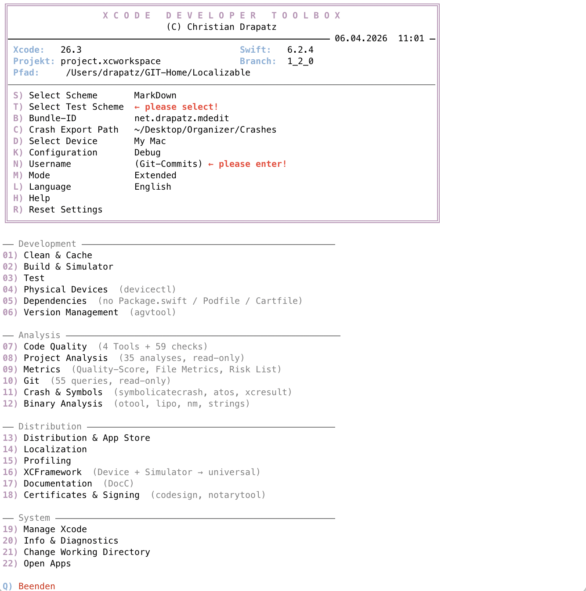

# Xcode Developer Toolbox

An interactive terminal tool for iOS and macOS developers.  
Combines build, test, simulator, code quality, Git analysis, distribution, and many other developer utilities in a clear menu — controlled through a single Swift project.  
The tool is available in **German and English** — more languages to follow.

---

## Why This Tool?

In the daily life of an Apple developer, you constantly switch between Xcode, Terminal, and various CLI tools: `xcodebuild`, `xcrun simctl`, `agvtool`, `otool`, `codesign`, `swiftlint`, `git log` …  
Each tool has its own flags, its own syntax, and its own pitfalls.

**Xcode Developer Toolbox** bundles all of this into a single entry point:

- **No flag lookups** — all common workflows are available as menu items.
- **No context switching** — build, test, clean, analysis, distribution, and Git queries all run in the same terminal.
- **No accidental modifications** — all analysis and Git functions operate **read-only** and modify neither code nor repository.
- **Ready to use immediately** — no external dependencies, runs anywhere Xcode is installed.

---

## Installation

```bash
git clone https://github.com/drapatzc/toolbox.git
cd toolbox
```

---

## Getting Started

Run the tool in the **root directory of the Xcode project** you want to analyze:

```bash
cd MyXcodeProject
../toolbox/toolbox
```

The tool automatically detects `.xcworkspace` or `.xcodeproj` files in the current directory.

### Usage



| Input | Action |
|-------|--------|
| Number + Enter | Open menu item |
| `X` or `Q` + Enter | Back / Quit |
| `S` | Select scheme |
| `D` | Select device / simulator |
| `K` | Configuration (Debug / Release) |
| `N` | Set username (for Git) |
| `B` | Set bundle ID |
| `M` | Toggle mode (Simple / Extended) |
| `H` | Context-sensitive help |

Settings are persistently stored in `~/.xcode_toolbox_prefs.json`.

---

## Features

The tool offers two modes: a **simple menu** with the most important daily tasks and an **extended menu** with 20 submenus and over 100 individual functions.

### Development

| Menu | Description |
|------|-------------|
| **Clean & Cache** | Delete Derived Data, Module Cache, simulator data, and SPM cache |
| **Build & Simulator** | Build, run, control simulator (screenshot, Dark/Light Mode, reset) |
| **Test** | Unit tests, UI tests, code coverage, and test reports |
| **Physical Devices** | Install and control apps on real devices via `devicectl` |
| **Dependencies** | Manage SPM, CocoaPods, and Carthage |
| **Version Management** | Change build and marketing version via `agvtool` |

### Analysis & Quality

| Menu | Description |
|------|-------------|
| **Code Quality** | 63 static checks for patterns and risks (e.g., force-unwraps, retain cycles, TODOs) |
| **Project Analysis** | 38 read-only analyses of structure, imports, protocols, and file boundaries |
| **Metrics** | Quality score, file metrics, risk list, and exportable reports |
| **Git** | 23 read-only queries on history, authors, branches, and commit search |
| **Crash & Symbols** | `symbolicatecrash`, `atos`, xcresult evaluation, and dSYM handling |
| **Binary Analysis** | `otool`, `lipo`, `nm`, `strings` for the compiled app binary |

### Distribution

| Menu | Description |
|------|-------------|
| **Distribution & App Store** | Create IPA, upload, notarization, release workflows |
| **Localization** | Check strings files, missing keys, and placeholder validation |
| **Profiling** | Launch Instruments, analyze build times, evaluate cache sizes |
| **XCFramework** | Combine device and simulator builds into universal frameworks |
| **Documentation** | Generate, preview, and build DocC |
| **Certificates & Signing** | Certificates, provisioning profiles, and `notarytool` integration |

### System & Tools

| Menu | Description |
|------|-------------|
| **Manage Xcode** | Open, close, and switch between Xcode versions |
| **Info & Diagnostics** | Disk usage, installed tool versions, and system info |

---

## Requirements

| Requirement | Note |
|-------------|------|
| **macOS** | Tested on macOS 13+ |
| **Xcode** | Including Xcode Command Line Tools (`xcode-select --install`) |
| **Swift 5.9+** | Included with Xcode |

### Optional Tools

Some menu items use external tools that can be installed via Homebrew. Without these tools, the respective functions are unavailable, but the rest of the tool runs without restrictions.

```bash
brew install swiftlint     # Code quality: Linting
brew install swiftformat   # Code quality: Formatting
brew install periphery     # Project analysis: Unused code detection
```

---

## Project Structure

```
toolbox/
├── toolbox                   # Executable binary
├── README.md
├── Localizable.xcstrings     # Localization (DE+EN, ~1500 keys)
└── Documentation/
    ├── index.html
    ├── DESCRIPTION.md
    ├── DESCRIPTION.txt
    └── XcodeDeveloperToolbox_Presentation.pptx
```

---

## Technical Implementation

- **Language:** Swift
- **Build System:** Swift Package Manager (SPM)
- **Platform:** macOS (Executable Target)
- **UI:** ANSI escape sequences for colors, progress bars, and spinners in the terminal
- **Persistence:** User settings as JSON in `~/.xcode_toolbox_prefs.json`
- **Architecture:** Modular design with separate Core, Menu, Action, and Project layers
- **Safety:** Analysis functions operate exclusively read-only — no automatic code changes, no Git writes
- **Signal Handling:** `Ctrl+C` safely aborts running operations without quitting the tool
- **No external dependencies** — only Foundation and Xcode Command Line Tools

---

## Author

Christian Drapatz — 2026

---

## License

This project is not published under an open-source license.  
All rights reserved.
