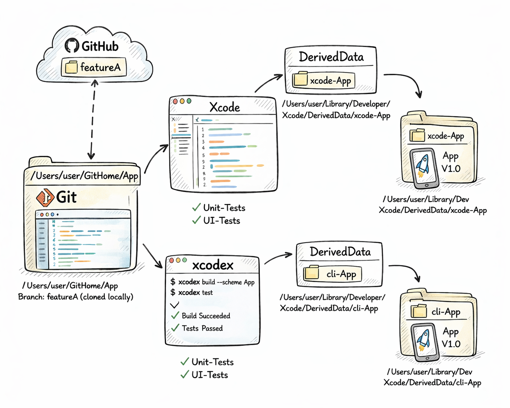
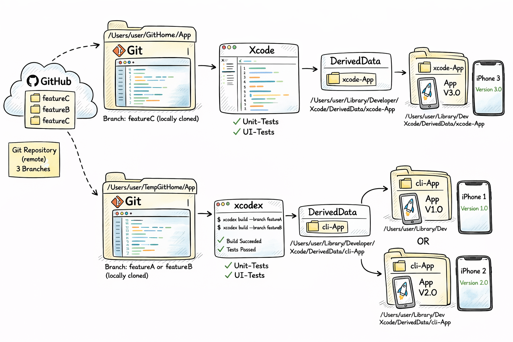

# Xcode Developer Toolbox

An interactive terminal tool for iOS and macOS developers.  
Combines build, test, simulator, code quality, Git analysis, distribution and many more features in a clear menu — powered by a single Swift project.  
Available in **17 languages**, including English and German.

---

## Why This Tool?

In the daily life of an Apple developer, you constantly switch between Xcode, Terminal and various CLI tools like `xcodebuild`, `xcrun simctl`, `agvtool`, `otool`, `codesign`, `swiftlint` or `git log`. Each tool has its own flags, its own syntax and its own pitfalls.

**Xcode Developer Toolbox** bundles all of that into a single entry point:

- **No flag lookups** — all common workflows are available as menu items
- **No context switching** — build, test, clean, analysis, distribution and Git queries all run in the same terminal
- **No accidental changes** — all analysis and Git functions work **read-only**
- **Ready to use immediately** — no external dependencies, runs anywhere Xcode is installed


---

## Own DerivedData — Independent from Xcode

The script uses its own DerivedData to run builds and tests, making it completely independent from Xcode. This means Xcode can stay open in the background — indexing or building on its own — without interfering. Each run happens in its own environment, so when something fails you can be confident the issue comes from the script, not leftover state. The downside: nothing is reused, so the first run does a full clean build, which takes longer and uses more disk space.



---

## Branch & Commit — Build and Compare Specific States

The script can check out any branch or commit from the Git repository, build it locally and launch it. Because it runs independently from Xcode, parallel builds are possible, making it easy to compare different project states side by side. It also lowers the barrier for non-iOS developers who need to run an iOS build without a full development environment set up.



---

## Installation

### 1. Download repository

```bash
git clone https://github.com/drapatzc/toolbox.git ~/GIT-Home/toolbox
```

### 2. Set execution permissions

```bash
chmod +x ~/GIT-Home/toolbox/toolbox
```

### 3. Set up alias (optional but recommended)

So you can launch the tool from anywhere in the terminal by typing `toolbox`:

**zsh (default on modern Macs):**

```bash
echo 'alias toolbox="$HOME/GIT-Home/toolbox/toolbox"' >> ~/.zshrc
source ~/.zshrc
```

**bash:**

```bash
echo 'alias toolbox="$HOME/GIT-Home/toolbox/toolbox"' >> ~/.bash_profile
source ~/.bash_profile
```

### 4. Test

```bash
toolbox
```

### Updating

```bash
cd ~/GIT-Home/toolbox
git pull
```

---

## Getting Started

Run the tool in the **root directory of the Xcode project** you want to analyze:

```bash
cd MyXcodeProject
toolbox
```

The tool automatically detects `.xcworkspace` or `.xcodeproj` files in the current directory.

---

## Controls

| Input | Action |
|-------|--------|
| Number + Enter | Open menu item |
| `X` or `Q` + Enter | Back / Quit |
| `S` | Select scheme |
| `D` | Select device / simulator |
| `K` | Configuration (Debug / Release) |
| `N` | Set username (for Git) |
| `B` | Set Bundle ID |
| `M` | Toggle mode (Simple / Extended) |
| `H` | Context-sensitive help |

Settings are persistently saved in `~/.xcode_toolbox_prefs.json`.

---

## Features

The tool offers two modes: a **simple menu** with the most important daily tasks and an **extended menu** with 20 submenus and over 100 individual functions.

### Development

| Menu | Description |
|------|-------------|
| **Clean & Cache** | Delete Derived Data, Module Cache, simulator data and SPM cache |
| **Build & Simulator** | Build, launch, control simulator (screenshot, Dark/Light Mode, reset) |
| **Test** | Unit tests, UI tests, code coverage and test reports |
| **Physical Devices** | Install and control apps on real devices via `devicectl` |
| **Dependencies** | Manage SPM, CocoaPods and Carthage |
| **Version Management** | Change build and marketing version via `agvtool` |

### Analysis & Quality

| Menu | Description |
|------|-------------|
| **Code Quality** | 63 static checks for patterns and risks (e.g. force-unwraps, retain cycles, TODOs) |
| **Project Analysis** | 38 read-only analyses of structure, imports, protocols and file boundaries |
| **Metrics** | Quality score, file metrics, risk list and exportable reports |
| **Git** | 23 read-only queries on history, authors, branches and commit search |
| **Crash & Symbols** | `symbolicatecrash`, `atos`, xcresult evaluation and dSYM handling |
| **Binary Analysis** | `otool`, `lipo`, `nm`, `strings` for the final app binary |

### Distribution

| Menu | Description |
|------|-------------|
| **Distribution & App Store** | Create IPA, upload, notarization, release workflows |
| **Localization** | Check strings files, missing keys and placeholder validation |
| **Profiling** | Launch Instruments, analyze build times, evaluate cache sizes |
| **XCFramework** | Combine device and simulator builds into universal frameworks |
| **Documentation** | Generate, preview and build DocC |
| **Certificates & Signing** | Certificates, provisioning profiles and `notarytool` integration |

### System & Tools

| Menu | Description |
|------|-------------|
| **Manage Xcode** | Open, close and switch between Xcode versions |
| **Info & Diagnostics** | Disk usage, installed tool versions and system info |

---

## Requirements

| Requirement | Note |
|-------------|------|
| **macOS 13+** | Tested from macOS Ventura onwards |
| **Xcode** | Including Xcode Command Line Tools (`xcode-select --install`) |
| **Swift 5.9+** | Included with Xcode |

### Optional Tools

Some menu items use external tools that can be installed via Homebrew. Without these tools the respective functions are unavailable — everything else runs without restrictions.

```bash
brew install swiftlint     # Linting
brew install swiftformat   # Formatting
brew install periphery     # Unused code detection
```

---

## Technical Details

- **Language:** Swift (Swift Package Manager)
- **Platform:** macOS (executable target)
- **UI:** ANSI escape sequences for colors, progress bars and spinners
- **Persistence:** JSON file at `~/.xcode_toolbox_prefs.json`
- **Architecture:** Modular design with Core, Menu, Action and Project layers
- **Safety:** Analysis functions work exclusively read-only — no automatic code changes
- **Signal Handling:** `Ctrl+C` safely aborts running operations without quitting the tool
- **No external dependencies** — only Foundation and Xcode Command Line Tools

---

## Configuration

The toolbox directory contains three pre-built configuration files:

| File | For whom? | Description |
|------|-----------|-------------|
| `default.conf` | Everyone | Default settings for a normal start |
| `developer.conf` | Developers | Extended settings for active developers |
| `senior.conf` | Experienced users | Full settings with all options enabled |

---

## Quick Start — All Commands at a Glance

```bash
git clone https://github.com/drapatzc/toolbox.git ~/GIT-Home/toolbox
chmod +x ~/GIT-Home/toolbox/toolbox
echo 'alias toolbox="$HOME/GIT-Home/toolbox/toolbox"' >> ~/.zshrc
source ~/.zshrc
toolbox
```

---

## Homepage

The official project website with all features, screenshots and the full installation guide is available at:

**[toolbox.betterlocale.com](https://toolbox.betterlocale.com)**

There you'll find every menu, the spotlight features (Auto-Build, Multi-Simulator, Code Quality), a complete feature overview and the path to the source code. The site is available in English and German.

---

## Support the developer

**Like it? Help keep it alive.**

The Xcode Developer Toolbox is free — and stays free. If it saves you time in your daily workflow, a small contribution is very welcome. Every donation goes straight into new features, improvements and ongoing maintenance.

→ **[Support via PayPal](https://www.paypal.com/donate/?business=c.drapatz%40gmx.de&currency_code=EUR&item_name=Xcode+Developer+Toolbox)**

More on the homepage: [toolbox.betterlocale.com/#support](https://toolbox.betterlocale.com/#support)

---

## Developer

I build software for the Apple ecosystem — native iOS and macOS apps, my own games and AI-powered developer tools. My focus is on products that are technically clean, practical in everyday use and able to stand on their own.

### Portfolio

**[christiandrapatz.de](https://christiandrapatz.de)**

Personal site, projects, contact and background on my development work.

---

### AI apps

**[betterlocale.com](https://betterlocale.com)**

AI-powered macOS tools for iOS and macOS developers — designed to plug into the daily workflow.

- [BetterLocale Crash](https://betterlocale.com/en-crash/)
- [BetterLocale Code](https://betterlocale.com/en-code/)
- [BetterLocale Store](https://betterlocale.com/en-store/)
- [BetterLocale Doc](https://betterlocale.com/en-doc/)
- [BetterLocale MarkDown](https://betterlocale.com/en-markdown/)

---

### Games

**[atomiumgames.com](https://atomiumgames.com)**

Independent iOS games — built inside the Apple ecosystem, developed and published in-house.

- [crazy-monsters.com](https://crazy-monsters.com)
- [tower-arena.com](https://tower-arena.com)
- [strategy-war.com](https://strategy-war.com)
- [battle-alliance.com](https://battle-alliance.com)

---

### Apps

**[onetwoapps.de](https://www.onetwoapps.de)**

Practical apps for iOS and macOS — clear concepts, standalone products.

- [scanbox-app.de](https://scanbox-app.de)
- [meinhaushaltsbuch.app](https://meinhaushaltsbuch.app)
- [My Budget Book](https://www.onetwoapps.de/english/my-budget-book/)

---

## Author

Christian Drapatz — [christiandrapatz.de](https://christiandrapatz.de) — 2026

## License

This project is not published under an open-source license.  
All rights reserved.
